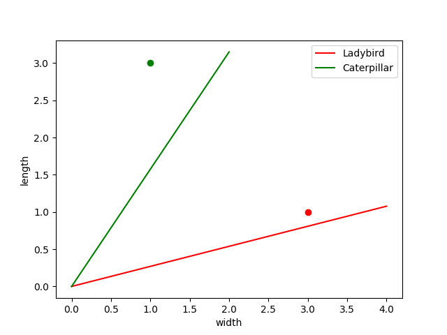

# SimpleClassifier
Simple classifier built in python that classifies on whether the bug is a caterpillar/ladybird depending on the width. This is practice to understand simple classification for neural networks

## Result

